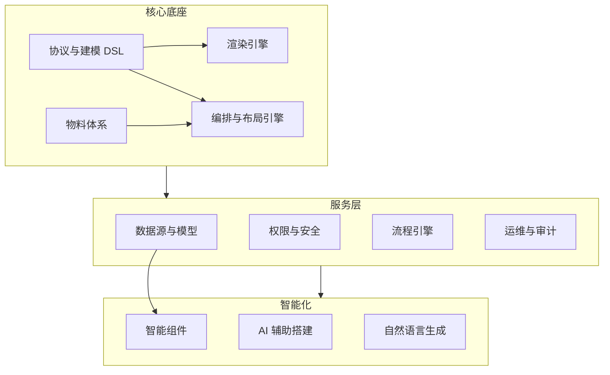

# 项目路线图 (Roadmap)

本文档基于《低代码平台架构实战》理念，规划了低代码引擎从**MVP**到**企业级平台**的演进路径。我们将优先夯实底层协议与渲染架构，再逐步叠加智能与 AI 能力。

## 🗺️ 架构演进全景

---

## ✅ 已发布版本 (Released)

### v1.0.0: MVP (Minimum Viable Product)

- **核心能力**: 基础三栏编辑器，拖拽布局，静态组件渲染。
- **技术栈**: Next.js, dnd-kit, TailwindCSS.

### v1.1.0: Data Engine (数据驱动核心)

- **核心能力**: Supabase 集成，Table/Form 数据绑定，基础 CRUD 闭环。
- **状态**: ✅ 已完成

---

## 🚀 迭代计划 (Upcoming)

### 📅 v1.2.0: 平台能力增强与架构完善 (Platform Hardening)

**目标**: 补齐低代码平台的"核心缺失板块"，提升编辑器的可用性与交互深度，对齐行业标准架构。

#### 1. 编排与交互引擎 (Layout & Interaction)

- [ ] **撤销/重做 (Undo/Redo)**: 基于快照或 Action 链的历史记录管理，保障编辑安全。
- [ ] **高级辅助交互**: 拖拽时的辅助引导线、智能吸附对齐 (Snapping)。
- [ ] **多视图模式**: 桌面端/移动端预览切换，响应式布局模拟。

#### 2. 动态性与逻辑增强 (Dynamics & Logic)

- [ ] **组件联动机制**:
  - 基于**表达式**的显隐控制 (e.g., `{{ formData.type === 'other' }}`).
  - 基于**发布订阅**的事件通信 (Event Bus)。
- [ ] **自定义脚本与沙箱**:
  - 支持用户编写 JS 转换函数。
  - 安全沙箱机制 (基于 `new Function` + `with` 或 iframe 隔离)。

#### 3. 协议与工程化 (Protocol & Engineering)

- [ ] **Schema 版本管理**: 页面发布历史，版本回滚能力。
- [ ] **基础出码 (Code Generation)**:
  - 查看当前页面的 JSON Schema。
  - 导出可运行的 React 代码预览 (Source Code Preview)。

---

### 📅 v1.3.0: 智能组件与模型体系 (Smart Components)

**目标**: 让组件"读懂"数据模型，实现 Model-Driven 的自动化 UI 生成，降低配置门槛。

#### 1. 智能物料 (Smart Materials)

- [ ] **Smart Form**: 拖入即用，自动读取 Supabase 表结构生成对应的输入控件（类型推断）。
- [ ] **Smart Table**: 自动生成列配置，内置服务端分页、排序、过滤。
- [ ] **高级数据组件**:
  - `RemoteSelect`: 关联表外键自动搜索。
  - `FileUploader`: 对接 Storage 的文件/图片上传。

#### 2. 物料扩展体系 (Material Extension)

- [ ] **远程物料加载**: 支持通过 URL 动态加载第三方组件 (UMD/Module Federation)。
- [ ] **自定义组件脚手架**: 提供 CLI 工具，允许开发者开发并上传自定义组件。

---

### 📅 v1.4.0: 运营体系与数据治理 (Operation & Governance)

**目标**: 满足企业级应用的数据管理、权限控制与运维需求。

#### 1. 数据安全与权限 (Security)

- [ ] **可视化 RLS 配置**: 在编辑器内配置行级安全策略 (Row Level Security)。
- [ ] **字段级权限**: 控制特定角色的字段读写/显隐。

#### 2. 数据生命周期 (Lifecycle)

- [ ] **软删除与恢复**: `deleted_at` 机制与回收站功能。
- [ ] **操作审计 (Audit Log)**: 记录关键数据的变更日志与操作人。
- [ ] **数据导入导出**: 支持 Excel/CSV 的批量导入导出与数据清洗。

---

### 📅 v1.5.0: AI 赋能与生态 (AI Powered)

**目标**: 利用 LLM 重塑搭建体验，实现"一句话生成应用"。

#### 1. AIGC 搭建

- [ ] **Prompt to Schema**: 自然语言描述需求，自动生成表结构与页面布局。
- [ ] **AI Copilot**: 编辑器侧边栏助手，解释配置、生成逻辑代码、优化 SQL。

#### 2. 流程与生态

- [ ] **逻辑编排引擎**: 可视化流程图 (Flow Chart) 定义业务逻辑。
- [ ] **应用市场**: 模板与插件的分发平台。

---

## 🔮 待评估特性 (Backlog)

- **多人协同编辑**: 基于 CRDT (Yjs) 的实时协作。
- **多环境管理**: Dev/Staging/Prod 环境隔离与流水线发布。
- **微前端集成**: 作为子应用嵌入现有系统。
