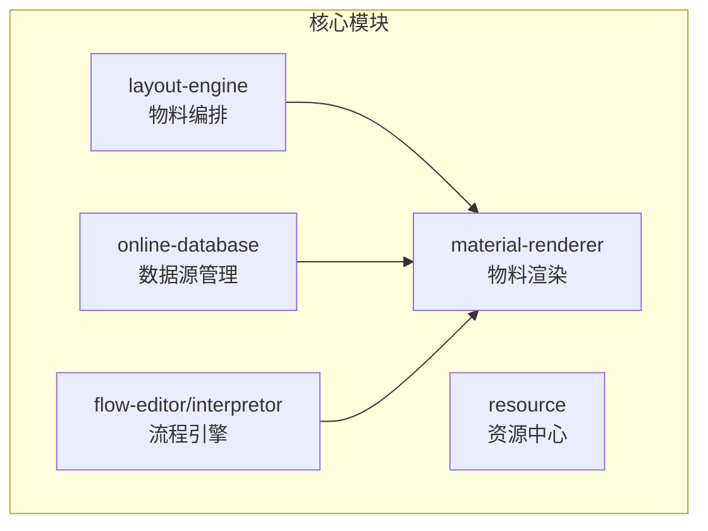
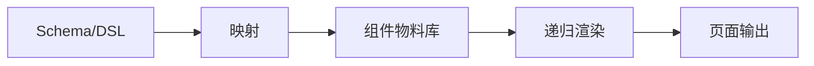
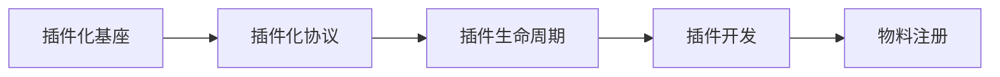
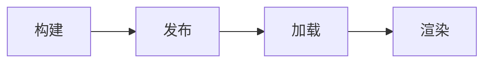
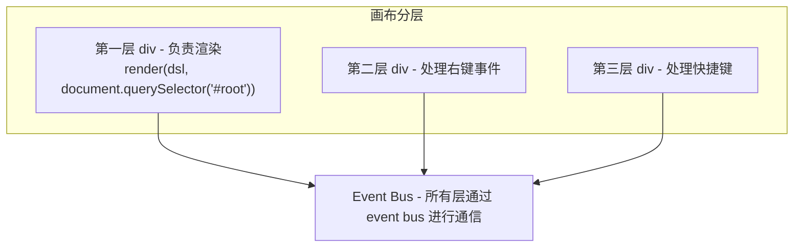
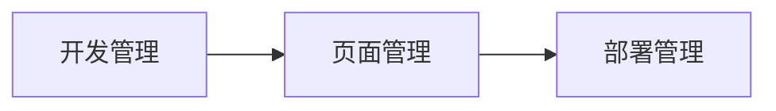

# 低代码平台核心设计与实现

> 本文档整合了低代码平台渲染设计与物料体系编排引擎的核心知识，系统性地介绍低代码平台的核心设计。

---

## 一、核心理念

### 1.1 低代码的本质

**低代码的本质就是解耦，把 UI 的描述和 UI 的实现分开**

### 1.2 核心能力

- 抽象和建模
- 架构设计

---

## 二、核心功能模块

### 2.1 相关概念

- 物料编排 -> 组件拖拽
- 物料渲染引擎 -> 组件在页面中的布局渲染
- 数据源管理 -> 数据表
- 流程编辑器(负责配置) + 流程引擎(负责执行 [ 内存型流程引擎、工作流流程引擎 ]) -> 流程编辑
- 资源中心 -> 静态资源管理

### 2.2 沉淀产物 (monorepo packages)

| 模块       | SDK                                | 说明                      | 技术难点                               |
| ---------- | ---------------------------------- | ------------------------- | -------------------------------------- |
| 物料编排   | `layout-engine`                    | 物料编排 SDK              | 4种布局引擎实现                        |
| 物料渲染   | `material-renderer`                | 物料渲染引擎 SDK          | 递归渲染、增量更新、主题适配           |
| 数据源管理 | `online-database`                  | 数据源管理 SDK            | 千万行数据的渲染                       |
| 流程引擎   | `flow-editor` / `flow-interpretor` | 流程编辑器 / 流程引擎 SDK | 复杂流程建模与执行                     |
| 资源中心   | `resource`                         | 资源中心管理平台          | 大文件上传、断点续传 (`file-uploader`) |



---

## 三、页面描述协议 (Schema/DSL)

### 3.1 核心原理

用数据结构完整描述 UI

平台的特定语言设计 DSL (Domain Specific Language)，JSONSchema，整个平台编排完成之后，存储的数据一定是一个 JSON。

### 3.2 Schema 关键信息

- 组件名称
- 组件属性
- 子节点
- 事件绑定
- 数据绑定
- ......

```javascript
// Schema 示例结构
{
  type: 'Component',      // 组件名称
  key: 'unique-id',       // 唯一标识
  props: {},              // 组件属性
  children: [],           // 子节点
  attrs: {},              // 属性
  animate: {},            // 动画配置
  actions: {}             // 交互动作
}
```

### 3.3 数据存储优化

为了性能考虑，拆分为框架结构 JSON 和 内容数据 JSON

确保渲染时，**先渲染框架再渲染数据**。

#### 增量更新

操作变量 OT -> 对 JSON 进行 patch 对比，识别出增、删、改、移动等操作，并将更新的数据进行保存

#### 可视区渲染

仅渲染用户可见区域，提升性能

---

## 四、布局引擎设计 (layout-engine)

### 4.1 引擎分类

| 布局类型        | 描述                                             | 适用场景           |
| --------------- | ------------------------------------------------ | ------------------ |
| **Flex 布局**   | 类似于传统写代码 flex 布局的方法，兼顾灵活和易用 | 管理后台、CRM、ERP |
| **Block 布局**  | 从上往下布局，相对灵活度比较低                   | 表单、OA、数据源   |
| **Grid 布局**   | 参考格子点来布局                                 | 仪表盘、可视化大屏 |
| **Canvas 布局** | 一般设计软件偏多，100%灵活                       | 设计工具、自由绘图 |

### 4.2 应用场景

1. 管理后台、CRM、ERP
2. 仪表盘
3. 表单、OA、数据源

---

## 五、渲染引擎设计 (material-renderer)

### 5.1 核心原理：映射 + 递归

- **映射**：根据 Schema 的组件类型映射**组件物料库**
- **递归**：根据 Schema 从根节点开始遍历到叶子节点



### 5.2 渲染器实现

用来将 JSON 数据渲染成页面内容的组件

Renderer，通过策略模式来负责：

1. 数据转化加工
2. 数据到组件的传递
3. 组件渲染

### 5.3 渲染器与出码

通常平台会提供 schema 渲染页面的功能，同时也可将所有配置输出 JSON Schema，我们称为**出码功能**

### 5.4 其他特性

1. 渲染方式
2. 设备兼容
3. 主题定制
   - 样式 token
   - 样式消费

---

## 六、物料体系设计

### 6.1 物料的核心组成

物料最重要的两个东西：

- 数据协议，JSON 数据
- 物料渲染引擎

### 6.2 核心思路

- 物料以独立、模块化的方式存在，可动态加载与扩展
- 提供灵活的布局能力(如 flex 布局)，支持不同的容器与子组件
- 使用标准化数据协议，支持物料的动态注册、拖拽、渲染及配置

### 6.3 插件化设计

#### 前置概念

- 插件化基座
- 插件化协议
- 插件生命周期
- 插件开发



#### 物料插件化的优点

1. **高扩展性**：新增物料无需修改底座代码，只需注册插件
2. **灵活加载**：支持本地与远程物料的无缝加载
3. **解耦性强**：物料与核心逻辑分离，维护成本低
4. **动态化**：支持按需加载，减少初始加载时间

### 6.4 远程物料管理

#### 全生命周期



1. **构建**
   - 物料协议
   - 产物模块化规范
2. **发布**
3. **加载**
   - 获取远程物料的配置
     - fetch/xhr
     - systemJs
     - modernJs
   - 使用 import 动态加载物料
   - 注册物料
   - 异步组件渲染物料

#### 优化策略

| 策略         | 说明                                                        |
| ------------ | ----------------------------------------------------------- |
| **缓存优化** | 使用 localStorage 或 IndexedDB 缓存已加载物料，减少重复加载 |
| **CDN 加速** | 将远程物料部署到 CDN，提高加载速度                          |
| **版本管理** | 为远程物料管理添加版本控制，避免兼容性问题                  |

### 6.5 实际应用场景

1. **物料市场**：低代码平台的用户可以从市场中挑选需要的物料(组件)并动态加载
2. **动态表单**：表单控件作为物料插件化，通过配置加载不同的控件
3. **动态布局**：根据用户需求，动态加载页面布局物料

---

## 七、编排引擎设计

低代码平台的物料体系和编排引擎是平台的核心组成部分，其设计目标是支持灵活、高效的页面布局编排，提供良好的开发者体验和用户体验。

### 7.1 核心思路

- 基于拖拽的交互模型，实现所见即所得的页面设计
- 引入 flex 布局引擎，支持复杂布局的自动化排列
- 提供布局数据的实时更新与保存能力，便于回显与编辑

### 7.2 微内核思想

操作的是 DSL (json树)，**f(state) -> view**

- 组合和渲染层隔离
- render runtime(渲染引擎sdk) + dsl(json) = 页面
- 事件：DND拖拽、Mouse Event

### 7.3 画布分层技术

借鉴浏览器渲染模型，使用冒泡机制，走到所有层



### 7.4 画布功能及拓展

#### 简单编排

- 物料均为块级，操作简便，不涉及复杂布局问题

#### 画布灵活编排

| 功能         | 实现方式                                                   |
| ------------ | ---------------------------------------------------------- |
| **无限画布** | 监听滚动事件，每次给画布加宽度                             |
| **引导线**   | 使用 div 画线(高度和宽度为1px)、绝对定位可拖动             |
| **吸附对齐** | 计算相近的 dom 节点，定6个点和3条线，距离相近时设置距离为0 |
| **其他**     | 旋转、快捷键、右键、缩放                                   |

### 7.5 配置面板

配置面板就是对物料进行配置，我们需要将**数据、视图、操作解耦**

#### 功能

- **撤销/重做 (undo/redo)**：使用队列，指针移动
- **预览**：render(dsl: {type, key, props, animate, actions}, attrs:{}, children)
- **提测、发布**

#### 中间层

- 权限控制
- 数据操作（转换）
- 暴露部分 api

---

## 八、数据源管理 (online-database)

### 8.1 概述

数据源、在线多维表

### 8.2 核心功能

1. **canvas table**：高性能表格渲染
2. **字段管理，单元格交互**
   - CellEditor
   - CellRenderer
   - CellValidator
   - CellRules
3. **表设计**
   - Schema(管理字段)
   - 业务表(存储字段数据)
4. **外部数据连接**

### 8.3 数据消费逻辑

1. **Query 模块进行消费**：在前端实现一个 sql 查询编辑器【低代码】
2. **变量的方式**

---

## 九、生命周期管理



- **开发管理**：物料开发、协议定义
- **页面管理**：页面编排、配置、预览
- **部署管理**：发布、版本控制、回滚

---

## 十、扩展功能与进阶

### 10.1 基础扩展

- 历史记录和版本
- 模板
- 分享
- 主题

### 10.2 进阶功能

| 功能           | 说明                                 |
| -------------- | ------------------------------------ |
| **协同编辑**   | crdt 算法，yjs、ot 等方案            |
| **定时任务**   | 自动化流程执行                       |
| **微前端集成** | 集成到其他系统的能力                 |
| **混合开发**   | 组件（ts、flow）和 json 混合开发     |
| **逻辑配置**   | 使用流程图（flow），最后生成业务逻辑 |

---

## 十一、技术选型方案

### 11.1 整体架构

1. 分模块设计
2. 整体架构
   - 构建
   - 规范
   - 包管理
   - 容器化

### 11.2 技术选型表

| 模块       | 技术选型                                   | 优势                           |
| ---------- | ------------------------------------------ | ------------------------------ |
| 布局引擎   | Interact.js、CanvasKit、@xflow             | 灵活拖拽与高性能渲染           |
| 数据源管理 | Axios、Apollo Client、PostgreSQL 多 Schema | 多源接入与动态绑定             |
| 流程引擎   | XFlow、BPMN 执行引擎                       | 支持复杂流程建模与执行         |
| 多维表格   | AG Grid、Handsontable                      | 高性能表格引擎、支持复杂操作   |
| 工程化架构 | Vite、ESLint、CommitLint、PNPM、Docker     | 快速构建、团队规范、一键化容器 |

---

## 十二、成果总结

### 12.1 拖拽布局

- 实现了基于 flex 的拖拽交互，支持子节点的动态插入与排列
- 提供实时区域指示器，提升用户操作体验

### 12.2 灵活的布局协议

- 定义了标准化的数据协议，支持复杂布局的描述与动态配置

### 12.3 高扩展性

- 支持任意新增物料组件，并通过统一协议参与布局编排

### 12.4 实时更新与保存

- 支持布局数据的动态更新和持久化保存，适用于低代码平台的页面搭建需求

### 12.5 业务价值

1. 灵活的布局引擎，支持多种场景
2. 动态数据源管理，支持复杂业务联动
3. 流程引擎简化复杂业务逻辑

### 12.6 技术架构优势

1. 模块化设计，支持不同功能解耦
2. 可扩展性强、支持未来新增功能。物料通过插件化体系组织，支持灵活横向扩展
3. 高性能渲染机制与缓存机制

---

## 十三、项目亮点难点参考

- 负责平台技术选型、基础架构及方案设计，包含：工程化相关方案设计与落地、各模块方案设计与核心实现
- 动态表单开发，借助 `Vee-validate`，基于 `hook` 实现可维护性更高的动态表单及表单设计工具
- 低代码物料出码功能，基于 `vue-json-pretty` 封装物料协议数据预览与编辑
- 主导页面组装模块设计，选用通用 `blocksuite` 方案，使页面元素丰富且高度可定制
- AI 数据建模及应用创建模块选用 `nodejs` 服务，借助 `langChainjs` 构建端到端语言模型服务
- 基于 `monaco-editor` 实现低代码编辑器复杂功能，包含自动补全、语法提示等 LSP 服务相关内容
- 主导封装 `webpack plugin` 及 `loader` 支持静态资源自动上传、源码脱敏防备、构建优化等
- 流程引擎及服务编排等内容实现，基于鼠标 `move` 事件封装 `vue draggable` 组件实现组件拖拽与页面内容编排
- 数据源支持 1000 万行表格数据渲染与编辑，通过 canvas 技术实现

---

> 文档来源：低代码项目经验分享整理
