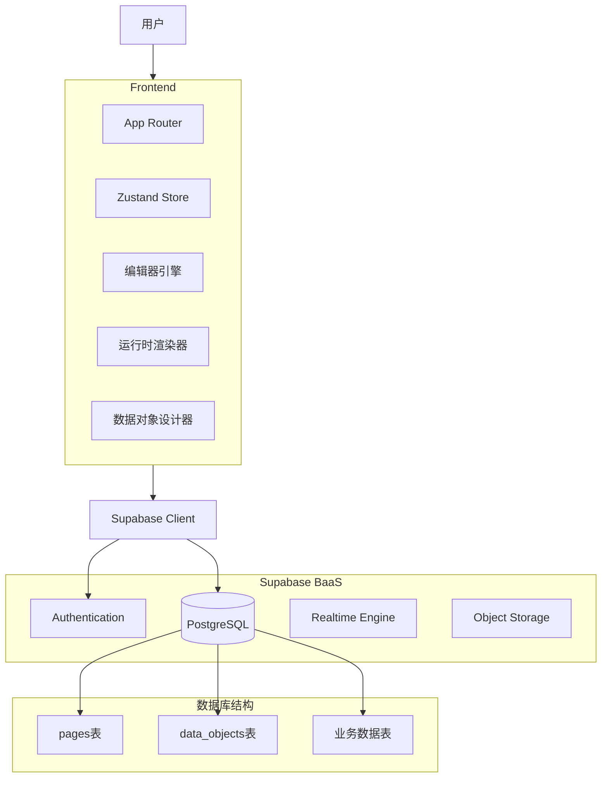
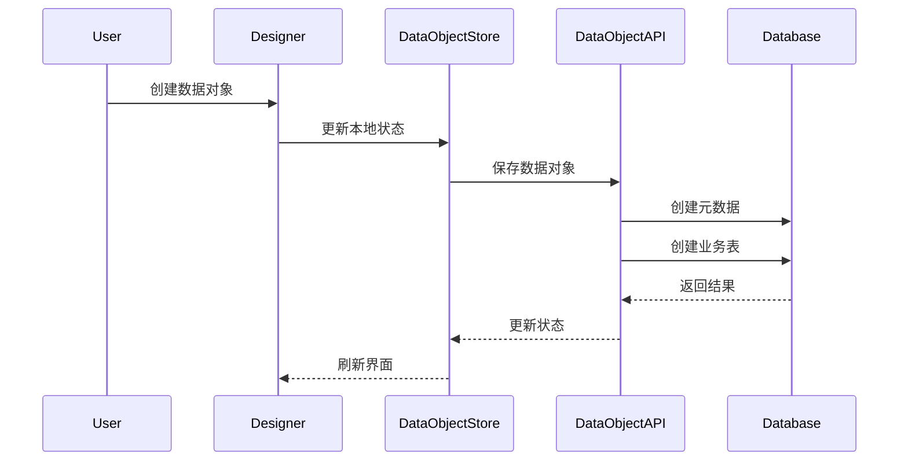

# 系统架构设计

## 概述

本文档描述低代码引擎的整体架构设计，包括 MVP 版本的实现和 v1.1.0 版本的扩展规划。

## 版本演进

### MVP 架构 (v1.0.0)

MVP 版本的架构文档请参考：[v1.0.0 架构设计](../versions/v1.0.0-MVP/architecture.md)

### v1.1.0 架构扩展 (当前开发版本)

## 1. 整体架构图



## 2. 技术栈选型

| 模块          | 技术            | 版本/说明                    |
| :------------ | :-------------- | :--------------------------- |
| **前端框架**  | Next.js         | 15 (App Router)              |
| **语言**      | TypeScript      | 5.x                          |
| **UI 组件库** | shadcn/ui       | 基于 Radix UI + Tailwind CSS |
| **样式引擎**  | Tailwind CSS    | 3.x                          |
| **状态管理**  | Zustand         | 5.x                          |
| **拖拽引擎**  | dnd-kit         | 6.x                          |
| **表单管理**  | React Hook Form | + Zod 验证                   |
| **图标库**    | Lucide React    | 统一图标风格                 |
| **后端服务**  | Supabase        | 托管的 PostgreSQL + Auth     |

## 3. 核心模块设计

### 3.1 数据对象管理系统 (新增)

#### 3.1.1 架构设计

```typescript
// 数据对象管理模块
interface DataObjectSystem {
  // 设计器
  Designer: {
    FieldEditor: React.Component // 字段编辑器
    ValidationRules: React.Component // 验证规则配置
    PreviewPanel: React.Component // 结构预览
  }

  // 管理器
  Manager: {
    DataObjectList: React.Component // 数据对象列表
    CRUDOperations: Service // CRUD 操作服务
    SyncService: Service // 数据同步服务
  }

  // 运行时
  Runtime: {
    TableGenerator: Service // 表格生成器
    FormGenerator: Service // 表单生成器
    ValidationEngine: Service // 验证引擎
  }
}
```

#### 3.1.2 数据流设计



### 3.2 编辑器系统 (增强)

#### 3.2.1 操作记录系统

```typescript
interface OperationHistorySystem {
  // 拦截器
  Interceptor: {
    StoreMiddleware: Middleware // Zustand 中间件
    ActionLogger: Service // 操作日志记录
  }

  // 展示
  Viewer: {
    HistoryPanel: React.Component // 历史记录面板
    OperationList: React.Component // 操作列表
  }

  // 存储
  Storage: {
    LocalStorage: Service // 本地存储
    Database: Service // 数据库存储
  }
}
```

#### 3.2.2 增强的属性面板

```typescript
interface EnhancedPropertyPanel {
  // 标签页结构
  Tabs: {
    PropertiesTab: React.Component // 属性配置
    StyleTab: React.Component // 样式配置
    EventTab: React.Component // 事件配置
    DataTab: React.Component // 数据配置
  }

  // 动态表单
  DynamicForm: {
    SchemaGenerator: Service // 配置方案生成
    Validation: Service // 表单验证
  }
}
```

### 3.3 组件系统 (扩展)

#### 3.3.1 输入组件架构

```typescript
interface InputComponents {
  // 基础输入组件
  Basic: {
    Input: React.Component<InputProps>
    Select: React.Component<SelectProps>
    Textarea: React.Component<TextareaProps>
  }

  // 选择组件
  Selection: {
    Checkbox: React.Component<CheckboxProps>
    Radio: React.Component<RadioProps>
    Switch: React.Component<SwitchProps>
  }

  // 日期组件
  DatePicker: {
    DatePicker: React.Component<DatePickerProps>
    RangePicker: React.Component<RangePickerProps>
  }
}
```

#### 3.3.2 Form 容器化架构

```typescript
interface FormContainerSystem {
  // 容器组件
  Container: {
    Form: React.Component<FormProps> // Form 容器
    FormItem: React.Component<ItemProps> // 表单项
    FormProvider: React.Component // 数据提供者
  }

  // 数据收集
  DataCollection: {
    Collector: Service // 数据收集器
    Mapper: Service // 字段映射器
    Validator: Service // 数据验证
  }
}
```

## 4. 数据库设计

### 4.1 核心表结构

#### 4.1.1 数据对象表

```sql
CREATE TABLE data_objects (
  id UUID PRIMARY KEY DEFAULT gen_random_uuid(),
  name TEXT NOT NULL UNIQUE,
  description TEXT,
  fields JSONB NOT NULL DEFAULT '[]'::jsonb,
  table_name TEXT NOT NULL UNIQUE,
  created_at TIMESTAMPTZ DEFAULT now(),
  updated_at TIMESTAMPTZ DEFAULT now()
);
```

#### 4.1.2 操作记录表

```sql
CREATE TABLE operation_records (
  id UUID PRIMARY KEY DEFAULT gen_random_uuid(),
  page_id UUID REFERENCES pages(id) ON DELETE CASCADE,
  type TEXT NOT NULL CHECK (type IN ('add', 'delete', 'update', 'move')),
  component_id TEXT,
  description TEXT NOT NULL,
  before_data JSONB,
  after_data JSONB,
  created_at TIMESTAMPTZ DEFAULT now()
);
```

### 4.2 动态表管理策略

1. **表命名规范**: `do_{data_object_id}_{timestamp}`
2. **字段命名**: 遵循数据库命名规范
3. **索引管理**: 根据字段类型自动创建索引
4. **迁移策略**: 增量更新，保留历史数据

## 5. API 设计

### 5.1 数据对象 API

#### RESTful 接口

```
GET    /api/data-objects          # 获取数据对象列表
POST   /api/data-objects          # 创建数据对象
GET    /api/data-objects/:id      # 获取单个数据对象
PUT    /api/data-objects/:id      # 更新数据对象
DELETE /api/data-objects/:id      # 删除数据对象
```

#### 数据管理接口

```
GET    /api/data/:tableName       # 获取数据
POST   /api/data/:tableName       # 创建数据
PUT    /api/data/:tableName/:id   # 更新数据
DELETE /api/data/:tableName/:id   # 删除数据
```

### 5.2 操作记录 API

```
GET    /api/operations/:pageId    # 获取页面操作历史
POST   /api/operations            # 记录操作
```

## 6. 性能优化策略

### 6.1 前端优化

1. **组件懒加载**: 按需加载组件代码
2. **虚拟滚动**: 大数据列表性能优化
3. **状态优化**: 使用选择器减少不必要的渲染
4. **缓存策略**: API 响应缓存和组件缓存

### 6.2 后端优化

1. **查询优化**: 使用索引和查询优化
2. **连接池**: 数据库连接池管理
3. **批量操作**: 支持批量数据操作
4. **实时更新**: 使用 Supabase Realtime

## 7. 安全考虑

### 7.1 数据安全

1. **RLS 策略**: 行级安全策略
2. **数据验证**: 输入数据严格验证
3. **SQL 注入**: 使用参数化查询
4. **权限控制**: 基于角色的访问控制

### 7.2 操作安全

1. **操作审计**: 记录所有敏感操作
2. **数据备份**: 定期数据备份
3. **版本控制**: 重要操作版本管理
4. **回滚机制**: 支持操作回滚

## 8. 扩展性设计

### 8.1 插件系统 (规划中)

1. **组件插件**: 支持自定义组件
2. **数据源插件**: 支持多种数据源
3. **功能插件**: 扩展平台功能
4. **主题插件**: 自定义界面主题

### 8.2 微前端架构 (规划中)

1. **模块拆分**: 按功能模块拆分
2. **独立部署**: 模块独立部署
3. **技术栈灵活**: 支持多种技术栈
4. **渐进迁移**: 平滑迁移路径

## 9. 监控与运维

### 9.1 性能监控

1. **前端监控**: 页面性能、错误监控
2. **API 监控**: 接口性能、成功率监控
3. **数据库监控**: 查询性能、连接数监控
4. **资源监控**: CPU、内存、存储监控

### 9.2 日志管理

1. **应用日志**: 结构化日志记录
2. **错误日志**: 错误详情和堆栈
3. **审计日志**: 敏感操作记录
4. **性能日志**: 性能指标记录

## 10. 未来架构演进方向

1. **云原生**: Kubernetes 部署
2. **多租户**: 支持多租户架构
3. **分布式**: 微服务化改造
4. **AI 集成**: AI 辅助开发功能

---

**文档版本**: 2.0
**最后更新**: 2025-12-11
**适用版本**: v1.1.0+
