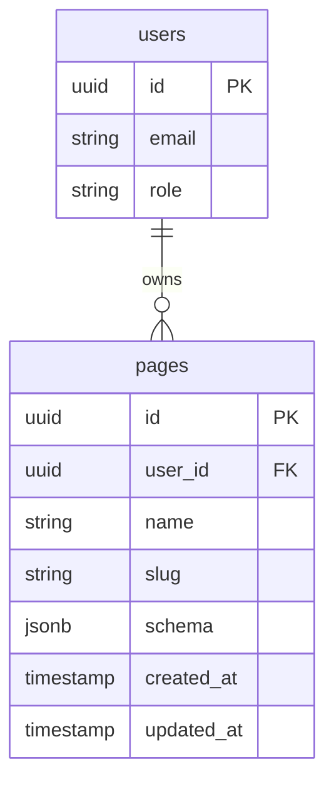

# 数据库设计

## 1. ER 图



## 2. 表结构定义 (SQL)

### 2.1 `pages` 表

存储低代码平台生成的页面配置。

```sql
create table public.pages (
  id uuid not null default gen_random_uuid(),
  user_id uuid not null default auth.uid(),
  name text not null,
  slug text not null,
  schema jsonb null default '{}'::jsonb,
  created_at timestamptz not null default now(),
  updated_at timestamptz not null default now(),

  -- 主键约束
  constraint pages_pkey primary key (id),

  -- 唯一性约束：URL slug 全局唯一（或按用户唯一，视需求定，MVP建议全局唯一简化路由）
  constraint pages_slug_key unique (slug),

  -- 外键约束：关联到 auth.users，用户删除时级联删除页面
  constraint pages_user_id_fkey foreign key (user_id) references auth.users (id) on delete cascade
);

-- 索引优化：频繁按 user_id 查询页面列表
create index pages_user_id_idx on public.pages (user_id);
```

## 3. 安全策略 (RLS)

为了确保数据安全，必须启用行级安全策略 (Row Level Security)。

```sql
-- 1. 启用 RLS
alter table public.pages enable row level security;

-- 2. 查询策略：用户只能查看自己的页面
create policy "Users can view own pages"
on public.pages for select
to authenticated
using (auth.uid() = user_id);

-- 3. 插入策略：用户只能插入归属于自己的页面
create policy "Users can insert own pages"
on public.pages for insert
to authenticated
with check (auth.uid() = user_id);

-- 4. 更新策略：用户只能更新自己的页面
create policy "Users can update own pages"
on public.pages for update
to authenticated
using (auth.uid() = user_id);

-- 5. 删除策略：用户只能删除自己的页面
create policy "Users can delete own pages"
on public.pages for delete
to authenticated
using (auth.uid() = user_id);
```

## 4. 业务数据表

业务数据表（如 `products`, `orders`）由用户在 Supabase Dashboard 中自行创建。
平台通过 `information_schema` 读取这些表的元数据，但不直接管理其结构。
业务表的 RLS 策略也由用户自行配置，平台通过 Supabase Client 访问时会自动遵循这些策略。
