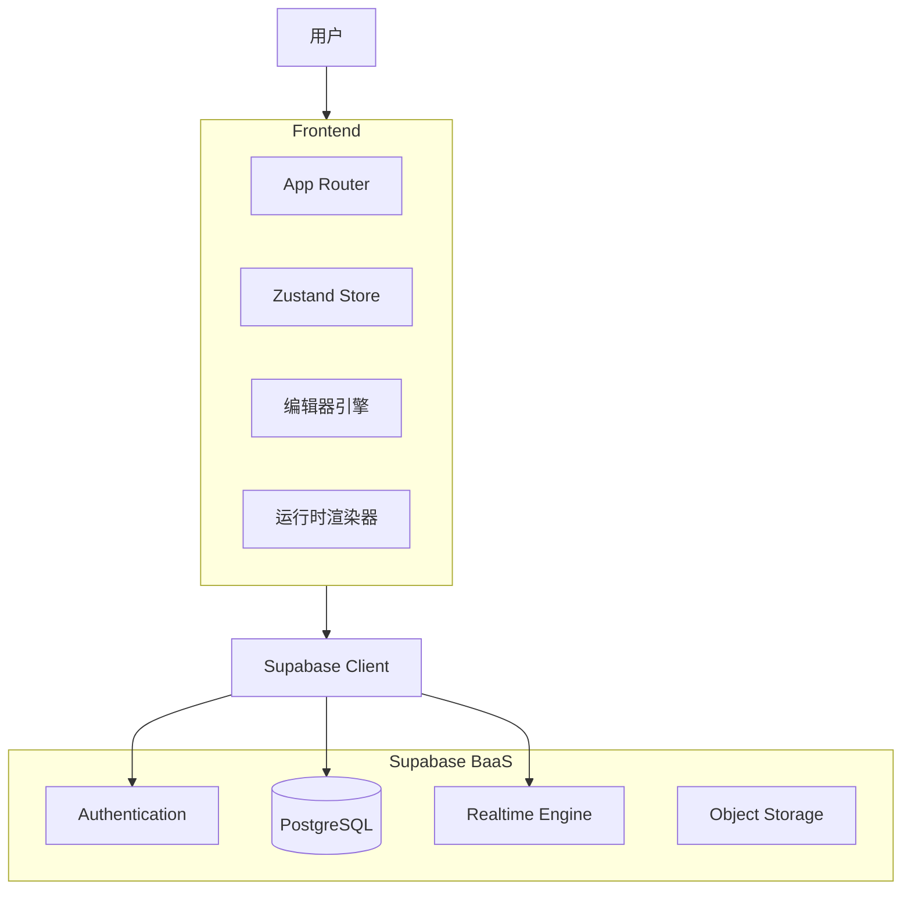

# 系统架构设计

## 1. 高层架构图

## 2. 技术栈选型

| 模块          | 技术            | 版本/说明                    |
| :------------ | :-------------- | :--------------------------- |
| **前端框架**  | Next.js         | 15 (App Router)              |
| **语言**      | TypeScript      | 5.x                          |
| **UI 组件库** | shadcn/ui       | 基于 Radix UI + Tailwind CSS |
| **样式引擎**  | Tailwind CSS    | 3.x                          |
| **状态管理**  | Zustand         | 5.x (轻量级，适合编辑器状态) |
| **拖拽引擎**  | dnd-kit         | 6.x (现代化，无障碍支持好)   |
| **表单管理**  | React Hook Form | + Zod 验证                   |
| **图标库**    | Lucide React    | 统一图标风格                 |
| **后端服务**  | Supabase        | 托管的 PostgreSQL + Auth     |

## 3. 核心模块划分

### 3.1 编辑器模块 (`/components/editor`)

负责页面的可视化搭建，核心职责包括：

- **Canvas**: 渲染画布，处理组件放置 (`useDroppable`)。
- **Sidebar**: 组件物料堆，提供拖拽源 (`useDraggable`)。
- **PropertyPanel**: 属性配置表单，双向绑定当前选中组件。
- **EditorStore**: 全局状态中心，管理组件树、选中态、历史记录。

### 3.2 运行时模块 (`/components/runtime`)

负责最终页面的渲染，核心职责包括：

- **PageRenderer**: 递归解析 Schema 并渲染组件。
- **DataBinding**: 解析 `{{...}}` 表达式，注入上下文数据。
- **ActionExecutor**: 执行交互动作（如提交表单、打开弹窗）。

### 3.3 服务层 (`/lib/services`)

封装与 Supabase 的交互逻辑，提供统一的 API 接口：

- `PageService`: 页面 CRUD。
- `SchemaService`: 数据库元数据获取。
- `DataService`: 业务数据 CRUD。

## 4. 数据流向

### 4.1 编辑流程

1.  **初始化**: `EditorPage` 加载 -> `PageService.getPage(id)` -> 初始化 `EditorStore`。
2.  **操作**: 用户拖拽/修改属性 -> `EditorStore` 更新组件树 -> `Canvas` 重新渲染。
3.  **保存**: 用户点击保存 -> `EditorStore` 导出 JSON -> `PageService.updatePage()` -> 写入 DB。

### 4.2 运行流程

1.  **加载**: `RuntimePage` 加载 -> `PageService.getPage(id)` -> 获取 Schema。
2.  **渲染**: `PageRenderer` 遍历 Schema -> 实例化组件 -> `useQuery` 获取业务数据。
3.  **交互**: 用户点击按钮 -> `ActionExecutor` 解析动作 -> 调用 `DataService` 或更新 UI 状态。
