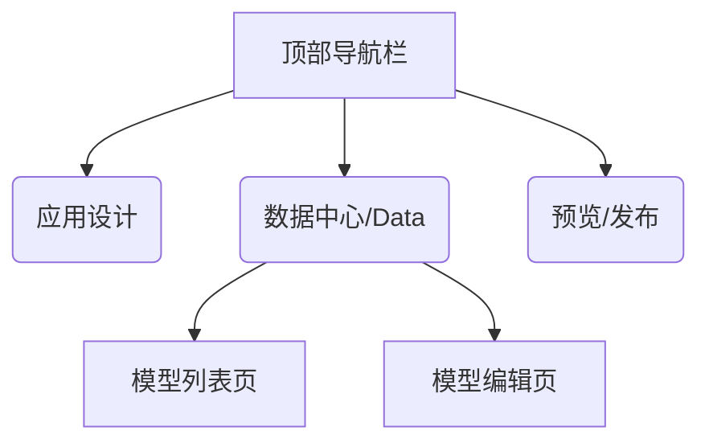

# v1.1.0 低保真原型设计 (Wireframes)

本文档展示了核心数据驱动功能的界面规划。

## 1. 入口与布局

在现有的编辑器布局中，新增 **"数据中心 (Data Center)"** 一级菜单，点击后进入数据管理全屏视图。



## 2. 数据模型管理 (Data Modeler)

### 2.1 模型列表页

展示所有已定义的数据对象。

```text
+-------------------------------------------------------+
|  数据中心                                   [+ 新建模型] |
+-------------------------------------------------------+
|                                                       |
|  [ 搜索模型... ]                                      |
|                                                       |
|  +----------------+  +----------------+  +----------+ |
|  |  [Customer]    |  |  [Order]       |  | [Product]| |
|  |                |  |                |  |          | |
|  | 客户基本信息    |  | 订单流水        |  | 商品库存  | |
|  | (5 Fields)     |  | (12 Fields)    |  |          | |
|  | 关联: Order    |  | 关联: Customer |  |          | |
|  +----------------+  +----------------+  +----------+ |
|                                                       |
+-------------------------------------------------------+
```

### 2.2 模型编辑页 (Schema Editor)

左侧字段支持**分组管理**，右侧属性支持**类型特定配置**和**高级验证**。

```text
+---------------------------------------------------------------------------------+
| < 返回  |  模型: Customer (customer_table)                  [ 预览SQL ] [ 发布 ] |
+---------------------------------------------------------------------------------+
|  字段列表 (Fields)           |  详细配置 (Detailed Configuration)                 |
|                              |                                                  |
|  [+ 添加分组] [+ 添加字段]    |  选中: [ email (Text) ]                          |
|                              |                                                  |
|  v 基础信息 (Base Info)      |  ----------------------------------------------  |
|    1. id (System)            |  显示名称: [ 电子邮箱           ]                  |
|    2. created_at (System)    |  字段标识: [ email              ]                  |
|    3. name (Text)            |  数据类型: [ 文本 (String)      ] [v]             |
|    4. email (Text) <         |                                                  |
|                              |  ----------------------------------------------  |
|  v 业务数据 (Business)       |  [ 类型特定配置 ]                                 |
|    5. status (Select)        |  (此区域随类型变化)                               |
|    6. balance (Number)       |  [ Text ] 最小长度: [ 0  ]  最大长度: [ 100 ]     |
|    7. amount (Number)        |           格式: [ 无         ] [v]                |
|    8. birthday (Date)        |                                                  |
|                              |  [ Number ] 精度: [ 2 (0.01) ]                   |
|                              |             最小值: [ 0 ] 最大值: [ 99999 ]       |
|                              |                                                  |
|                              |  [ Date ]   格式: [ YYYY-MM-DD ] [v]             |
|                              |                                                  |
|                              |  ----------------------------------------------  |
|                              |  [ 验证规则 (Validation) ]                        |
|                              |  [x] 必填字段 (Required)                         |
|                              |  [x] 唯一约束 (Unique)                           |
|                              |  (Regex & Default Value -> Deferred to v1.2.0)   |
|                              |                                                  |
+------------------------------+--------------------------------------------------+
```

## 3. 页面设计器集成 (Page Editor Integration)

> **[Note]**: The following sections (Data Source Panel & Binding Picker) are deferred to v1.2.0.

### 3.1 页面数据面板 (Data Source Panel)

支持**完整的数据加载配置**（过滤、排序、分页）。

```text
+------+----------------+---------------------------------------------------------+
| 组件 |  > 数据源 (Data) |  数据源详情配置: ds_customers                            |
+------+                |                                                         |
| 树   |  [+ 添加数据源] |  基本信息:                                              |
|      |                |    标识(ID): [ ds_customers     ] [ 自动生成 ]           |
|      |  v 本页数据源   |    关联模型: [ Customer         ] [v]                   |
|      |  - ds_customers|                                                         |
|      |    (Customer)  |  查询参数 (Query):                                      |
|      |  - ds_orders   |    过滤 (Filter):                                       |
|      |    (Order)     |      [ status ] [ 等于 (=)   ] [ active      ] [-]      |
|      |                |      [+ 添加条件]                                       |
|      |                |                                                         |
|      |                |    排序 (Sort):                                         |
|      |                |      [ created_at ] [ 降序 (DESC) ] [-]                 |
|      |                |      [+ 添加排序]                                       |
|      |                |                                                         |
|      |                |    分页 (Pagination):                                   |
|      |                |      默认每页条数: [ 20  ]                              |
|      |                |      [x] 开启前端分页控件                                |
|      |                |                                                         |
|      |                |  [ 保存配置 ]                                           |
+------+----------------+---------------------------------------------------------+
```

### 3.2 变量绑定选择器

```text
+-------------------------+
|  选择变量                |
+-------------------------+
| > Current User          |
| v Data Sources          |
|   v ds_customers        |
|     - data (List)       |
|     - total (Number)    |
|     - loading (Bool)    |
|     - page (Number)     |
|     - run() (Func)      |
|   > ds_orders           |
+-------------------------+
```
